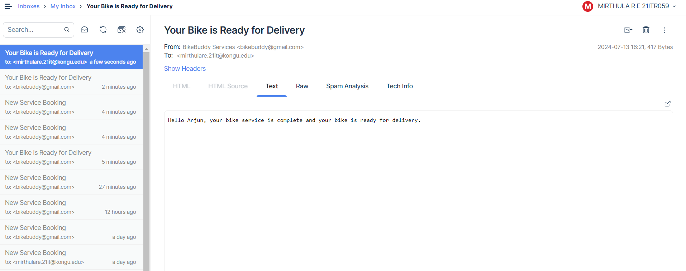

# Bike Service Application

This is a bike service application built using the MERN stack (MongoDB, Express, React, Node.js).

## Requirements

1. Visual Studio Code
2. npm
3. MongoDB Compass/Atlas

## Installation and Setup

1. Clone the repository:
    ```bash
    git clone https://github.com/MirthulaRE/bikeservice.git
    cd Bike-Service-Mern-Project
    ```

### Backend

2. Navigate to the backend directory and install dependencies:
    ```bash
    cd bikeservice/backend
    npm install
    ```
3. Open a new terminal for the frontend setup.

### Frontend

4. Navigate to the frontend directory and install dependencies:
    ```bash
    cd bikeservice/frontend
    npm install
    ```

## Running the Application

1. Start the backend server (in the backend terminal):
    ```bash
    npm start
    ```
2. Start the frontend (in the frontend terminal):
    ```bash
    npm run dev
    ```

3. Open the application in your browser at [http://localhost:5173/](http://localhost:5173/).

## Email Notification Service

Once the customer books a service, the owner receives an email notification with details about the service requested by the customer. Additionally, the customer will receive an email when their bike is ready for delivery.
<h1>Mail Servive</h1>



## Configuration

### Server

1. Create a `.env` file in the `server` directory and add the following environment variables:
    <h6>MAILTRAP_HOST=smtp.mailtrap.io<h6>
    <h6>MAILTRAP_PORT=2525</h6>
    <h6>MAILTRAP_USER=your_mailtrap_user</h6>
    <h6>MAILTRAP_PASS=your_mailtrap_password</h6>

## Usage

1. Register an account.
2. Log in with your credentials.
3. Book a bike service by filling out the service form.
4. View the status of your bookings on the booking status page.
5. Admins can manage services and view all bookings.

## Specifications:
<h3>Bike station owner:-</h3> 
<h5>Can able to create / edit / delete all his services and their details</h5>
<h5>View a list of all bookings ( pending, ready for delivery and completed)</h5>
<h5>View details of each booking- Mark a booking as ready for delivery- Mark a booking as completed- Receive an email whenever a booking is made</h5>
 
<h3>Customers:-</h3>
<h5>Can able to register for an account with his email address and mobile number</h5>
<h5>Book a service at a particular date</h5>
<h5>See the status of his booking- See all his previous bookings</h5>
<h5>Receive an email as soon as his booking is ready for delivery</h5>

<h1>Database Schema</h1>

<h2>Users Table</h2>
<table>
    <thead>
        <tr>
            <th>Field</th>
            <th>Data Type</th>
            <th>Constraints</th>
        </tr>
    </thead>
    <tbody>
        <tr>
            <td>name</td>
            <td>VARCHAR</td>
            <td>NOT NULL</td>
        </tr>
        <tr>
            <td>email</td>
            <td>VARCHAR</td>
            <td>NOT NULL, UNIQUE</td>
        </tr>
        <tr>
            <td>password</td>
            <td>VARCHAR</td>
            <td>NOT NULL</td>
        </tr>
        <tr>
            <td>role</td>
            <td>VARCHAR</td>
            <td>NOT NULL</td>
        </tr>
    </tbody>
</table>

<h2>Products Table</h2>
<table>
    <thead>
        <tr>
            <th>Field</th>
            <th>Data Type</th>
            <th>Constraints</th>
        </tr>
    </thead>
    <tbody>
        <tr>
            <td>serviceId</td>
            <td>INT</td>
            <td>NOT NULL, UNIQUE</td>
        </tr>
        <tr>
            <td>name</td>
            <td>VARCHAR</td>
            <td>NOT NULL</td>
        </tr>
        <tr>
            <td>description</td>
            <td>TEXT</td>
            <td>NOT NULL</td>
        </tr>
        <tr>
            <td>cost</td>
            <td>VARCHAR</td>
            <td>NOT NULL</td>
        </tr>
    </tbody>
</table>

<h2>Service Bookings Table</h2>
<table>
    <thead>
        <tr>
            <th>Field</th>
            <th>Data Type</th>
            <th>Constraints</th>
        </tr>
    </thead>
    <tbody>
        <tr>
            <td>fullname</td>
            <td>VARCHAR(100)</td>
            <td>NOT NULL</td>
        </tr>
        <tr>
            <td>emailid</td>
            <td>VARCHAR(100)</td>
            <td>NOT NULL</td>
        </tr>
        <tr>
            <td>mobile</td>
            <td>VARCHAR(15)</td>
            <td>NOT NULL</td>
        </tr>
        <tr>
            <td>model</td>
            <td>VARCHAR(100)</td>
            <td>NOT NULL</td>
        </tr>
        <tr>
            <td>service</td>
            <td>VARCHAR(100)</td>
            <td>NOT NULL</td>
        </tr>
        <tr>
            <td>booking_date</td>
            <td>DATETIME</td>
            <td>NOT NULL</td>
        </tr>
        <tr>
            <td>status</td>
            <td>VARCHAR(50)</td>
            <td>NOT NULL</td>
        </tr>
    </tbody>
</table>

</body>
</html>
<h1>Sample Data</h1>

<h2>Users Collection</h2>
<pre>
[
  {
    "name": "John Doe",
    "email": "john.doe@gmail.com",
    "password": "password123",
    "role": "user"
  },
  {
    "name": "Arjun",
    "email": "arjun@gmail.com",
    "password": "password456",
    "role":"user"
  }
]
</pre>

<h2>Products Collection</h2>
<pre>
[
  {
    "serviceId": 1,
    "name": "General Service",
    "description": "Keep your bike running smoothly with our comprehensive general service…",
    "cost": "₹1500"
  }
]
</pre>

<h2>Service Bookings Collection</h2>
<pre>
[
  {
    "fullname": "John Doe",
    "emailid": "john.doe@example.com",
    "mobile": "987654321",
    "model": "Yamaha",
    "service": "Water Wash",
    "booking_date": "2024-07-30",
    "status": "pending"
  }
]
</pre>

</body>
</html>

 
